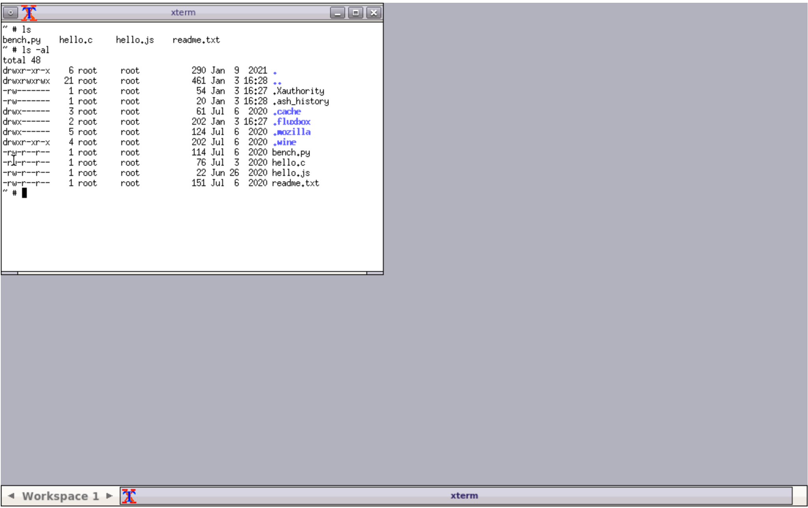
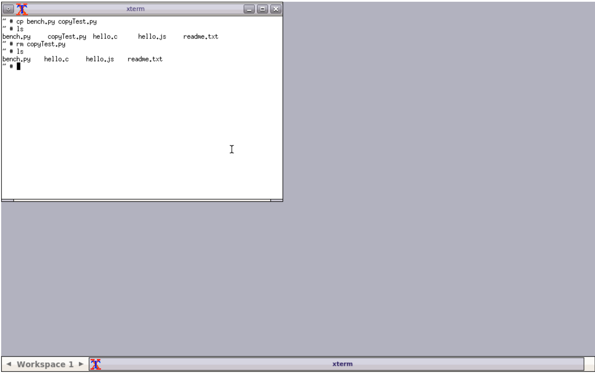
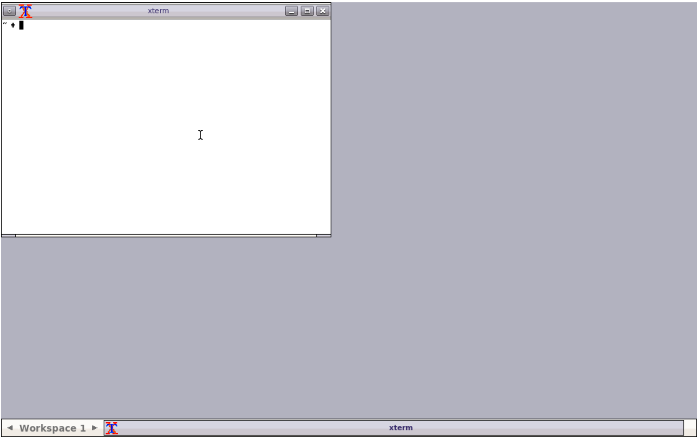
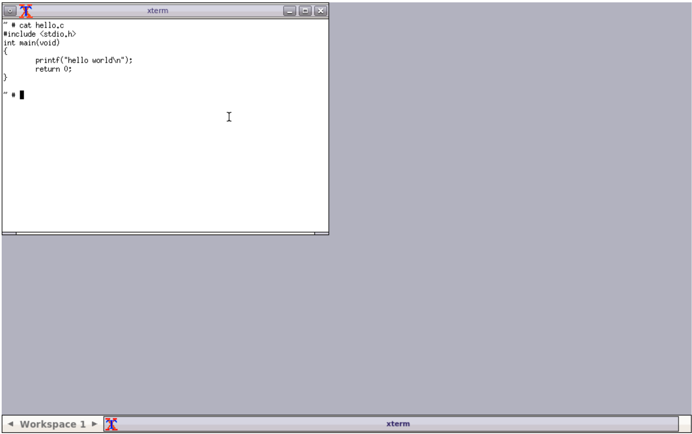
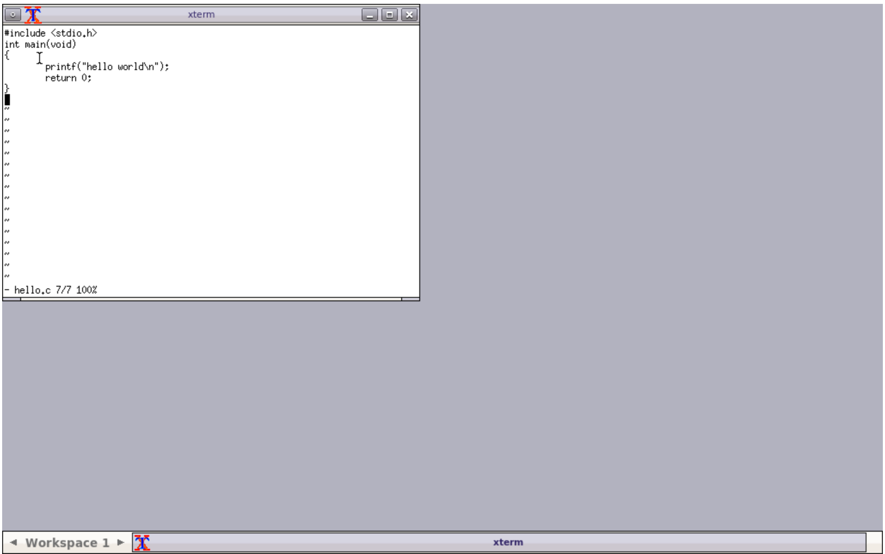
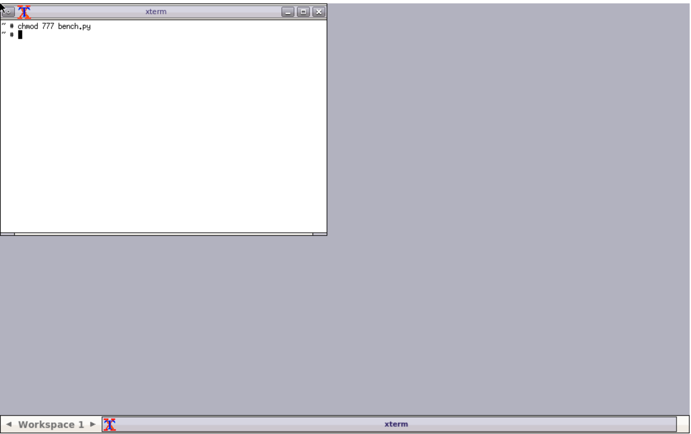

# [CS] 250103 실습 5번

### 현재 디렉토리 목록 조회 및 상세 조회
- `ls`
- `ls -al`

### 파일 복사 및 제거
- `cp bench.py copyTest.py`
- `rm copyTest.py`

### 터미널의 내용 지우기
- `clear`

### 파일 내용 출력
- `cat hello.c`

### 리눅스 에디터 창을 열기 및 닫기
- `vi hello.c`
- `:q!`

### 파일 권한 변경
- `chmod 777 bench.py`

