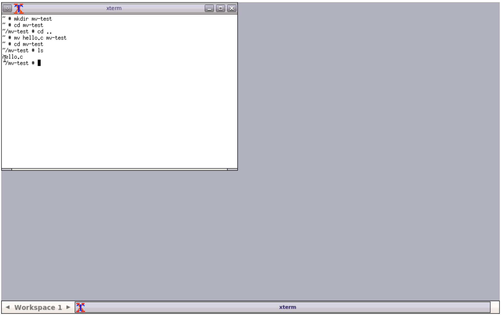
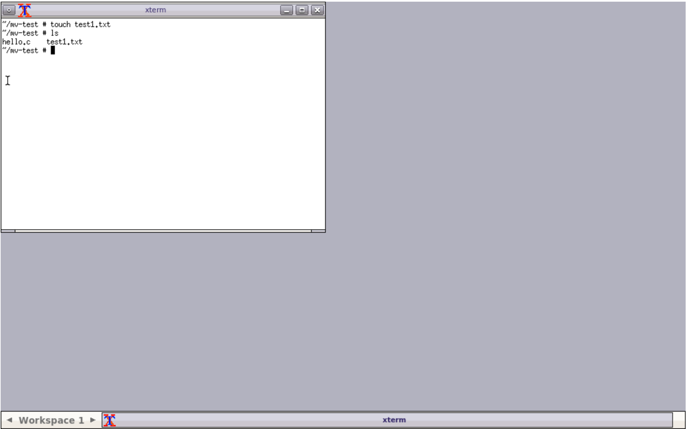
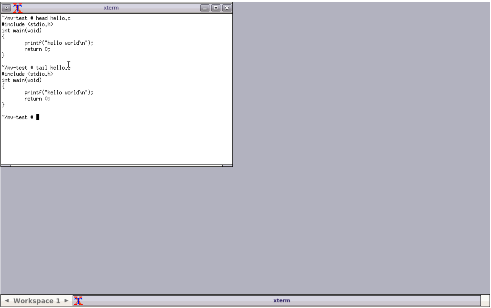

# [CS] 250103 실습 6번

### 현재 경로 보기
- `pwd`

### 디렉토리 생성 및 파일, 디렉토리 이동
- `mkdir mv-test`
- `cd mv-test`
- `cd ..`
- `mv hello.c mv-test`
- `cd mv-test`
- `ls`

### 비어있는 파일 생성
- `touch test1.txt`
- `ls`

### 파일 내용 중 처음/마지막 10줄 출력
- `head hello.c`
- `tail hello.c`

