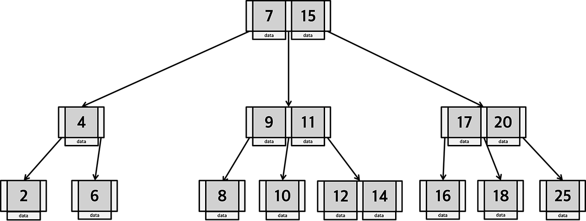
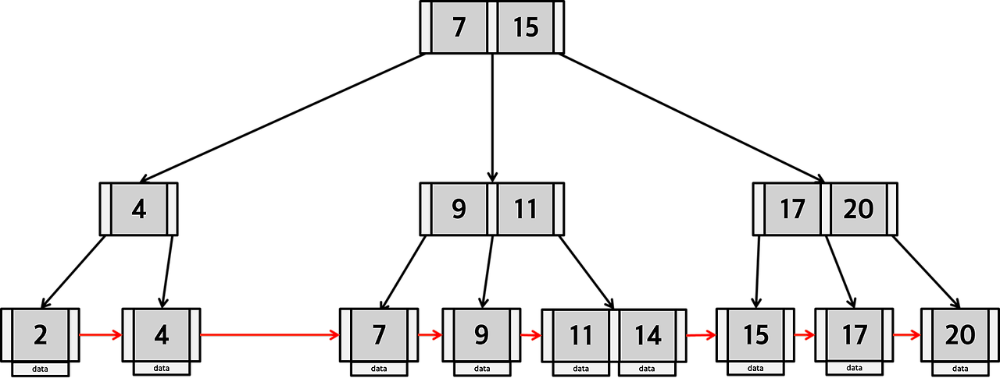

# TIL 250107

**다우기술 FITs 3기 임광영**

**학습 날짜 : 2025년 01월 07일 화요일**

---

### 주요 내용
- 알고리즘(Algorithm)
  - 어떤 문제를 해결하기 위해 구성된 일련의 절차.
- 시간 복잡도(Time Complexity)
  - 알고리즘이 얼마나 효율적으로 동작하는지 평가할 수 있는 척도.
  - 오메가 표기법($Big-\Omega$) : 최선의 경우.
  - 세타 표기법($Big-\Theta$) : 평균적인 경우.
  - 빅오 표기법($Big-O$) : 최악인 경우(일반적인 시간 복잡도).
  - $O(1)$ < $O(logn)$ < $O(n)$ < $O(nlogn)$ < $O(n^2)$ < $O(C^n)$.
- 자료구조(Data Structure)
  - 프로그램에서 쉽게 이용할 수 있도록 구성된 데이터 간의 논리적인 관계.
  - 배열, 연결 리스트, 스택, 큐, 그래프, 트리.
- 배열(Array)
  - 같은 자료형의 데이터를 순서대로 나열한 구조.
  - 각 요소는 인덱스를 통해 접근.
  - 고정된 크기를 가지는 연속된 메모리 공간에 데이터를 저장.
- 연결 리스트(Linked List)
  - 각 데이터들을 포인터로 연결하여 관리하는 구조.
  - 데이터 영역에 여러 개의 데이터가 저장.
  - 요소들이 메모리 상에서 연속적이지 않으며, 각각의 노드는 동적 할당되어 연결.
  - 단순 연결 리스트 : 각 노드에 포인터 영역이 하나.
  - 이중 연결 리스트 : 각 노드에 다음 노드를 가리키는 포인터와 이전 노드를 가리키는 포인터 영역 포함.
- 스택(Stack)
  - 데이터의 삽입과 삭제가 한쪽 방향에서만 일어나는 구조.
  - LIFO(Last-In First-Out).
  - 스택 삽입(Push) : 삽입된 데이터는 항상 스택의 최상단에 위치.
  - 스택 삭제(Pop) : 스택의 최상단에 있는 데이터를 삭제 및 반환.
- 큐(Queue)
  - 데이터가 한쪽 방향으로 삽입되고 반대 방향으로 삭제되는 구조.
  - FIFO(First-In First-Out).
  - 큐 삽입(Enqueue) : 삽입된 데이터는 큐의 뒤쪽에 위치.
  - 큐 삭제(Dequeue) : 큐에서 가장 먼저 들어온 데이터를 삭제 및 반환.
- 우선순위 큐(Priority Queue)
  - 각 요소가 우선순위를 가짐.
  - 우선순위가 높은 데이터를 먼저 반환.
  - 힙(Heap)을 활용하면 삽입과 삭제 연산 모두 효율적으로 처리 가능.
- 그래프(Graph)
  - 정점(vertex)과 간선(edge)으로 구성된 자료구조 $G = (V, E)$.
  - 무방향 그래프, 완전 그래프, 방향 그래프, 가중 그래프, 다중 그래프, 유사 그래프, 루프.
  - 차수 : 정점에 인접한 간선의 수.
  - 인접 행렬 : 정점들 간의 연결 관계를 나타내는 행렬.
  - 근접 행렬 : 정점과 간선의 관계를 나타내는 행렬.
  - 경로 : 간선을 연결하는 정점들을 나열한 것.
    - 같은 정점을 중복으로 거칠 수 없다.
- 깊이 우선 탐색(DFS)
  - 해당 정점과 연결된 방문하지 않은 정점을 방문하고, 다시 연결된 방문하지 않은 정점 순으로 방문.
- 너비 우선 탐색(BFS)
  - 해당 정점과 연결된 방문하지 않은 정점을 방문하고, 다시 연결된 방문하지 않은 정점을 수평적으로 방문.
- 트리(Tree)
  - 서브 트리, 부모 노드, 자식 노드, 형제 노드, 레벨, 깊이.
  - 이진 트리(Binary Tree) : 모든 노드들의 자식 노드가 두 개 이하인 트리.
  - 완전 이진 트리(Complete Binary Tree) : 단말 노드를 제외한 나머지 노드가 모두 두 개의 자식 노드를 가지고 있는 트리.
  - 포화 이진 트리(Full Binary Tree) : 완전 이진 트리 중에 모든 노드가 채워진 이진 트리.
  - 전위 순회(Pre-order), 중위 순회(In-order), 후위 순회(Post-order).
- 이진 탐색 트리(Binary Search Tree)
  - 왼쪽 서브 트리에 있는 모든 데이터가 현재 노드의 데이터보다 작고, 오른쪽 서브 트리에 있는 모든 데이터가 현재 노드의 데이터보다 큰 트리.
  - 트리가 편향 상태가 되어 $O(n)$의 시간 복잡도를 갖는 비효율적인 연산이 발생할 수 있음.
  - 이진 탐색 트리가 균형을 이루기 위해서는 높이가 $logn$에 가까워야 함.
- AVL 트리
  - 균형 이진 탐색 트리.
  - 자기 균형을 유지하며, 삽입이나 삭제 시 균형을 맞추기 위해 회전 연산을 수행.
- 레드-블랙 트리
  - 각 노드에 색깔을 부여하여 트리의 균형을 유지.
  - 높이 균형을 유지하기 위한 조건들을 따름.
- 힙(Heap)
  - 완전 이진 트리를 기반으로 하며 우선순위 큐 구현에 주로 사용.
  - 최소 힙, 최대 힙.
  - 우선순위 큐(Priority Queue), 힙 정렬(Heap Sort), 최소 신장 트리(MST).
- 몬테카를로 트리 탐색(MCTS)
  - 반복적으로 트리를 확장.
  - 각 노드에서 가능한 시나리오를 시뮬레이션하여 가장 유망한 경로 선택.
  - 선택, 확장, 시뮬레이션, 역전파.
- 탐색(Search)
  - 선형 탐색(Linear Search) : 원하는 데이터를 처음부터 순차적으로 비교하며 찾는 방법.
    - 최선 : $O(1)$, 최악 : $O(n)$
  - 이진 탐색(Binary Search) : 정렬된 데이터 집합을 반으로 쪼개 가면서 탐색하는 방법.
    - 최선 : $O(1)$, 최악 : $O(logn)$
- 정렬(Selection)
  - 선택 정렬(Selection Sort) : 가장 작은 데이터를 찾아 가장 앞의 데이터와 교환해나가는 방식.
    - 시간 복잡도 : $O(n^2)$
  - 삽입 정렬(Insertion Sort) : 이미 정렬된 부분의 적절한 위치에 삽입해가며 정렬하는 방식.
    - 시간 복잡도 : $O(n^2)$
  - 버블 정렬(Bubble Sort) : 서로 이웃한 데이터들을 비교해 가장 큰 데이터를 맨 뒤로 보내며 졍렬하는 방식.
    - 시간 복잡도 : $O(n^2)$
  - 퀵 정렬(Quick Sort) : 기준 Pivot를 중심으로 작거나 같은 값을 지닌 데이터는 앞으로, 큰 값을 지닌 데이터는 뒤로 가도록 분리하여 정렬하는 방법.
    - Pivot 선택 방법 : 첫번째나 마지막 요소, 임의의 요소, 중간값.
    - 시간 복잡도 : $O(nlogn)$
    - 공간 복잡도 : $O(logn)$
  - 병합 정렬(Merge Sort) : 배열을 반으로 나누고(Divide) 재귀적으로 정렬한 뒤, 정렬된 배열들을 병합(Conquer)하여 최종적으로 정렬하는 방법.
    - 시간 복잡도 : $O(nlogn)$
    - 공간 복잡도 : $O(n)$
  - 힙 정렬(Heap Sort) : 힙 자료구조를 사용하여 정렬하는 방법.
    - 시간 복잡도 : $O(nlogn)$
- 해시 테이블(Hash Table)
   - 키(Key)를 사용하여 데이터를 빠르게 검색할 수 있도록 설계된 자료구조.
   - 해시 함수(Hash Function)를 통해 인덱스로 변환하여 데이터를 저장 및 검색.
   - 시간 복잡도 : $O(1)$
   - 체이닝, 개방 주소법.
- 재귀 알고리즘(Recursive Algorithm)
  - 자기 자신을 호출하는 방식으로 문제를 해결하는 알고리즘.
  - 피보나치 수열 : $f(n) = f(n - 2) + f(n - 1)$.
- 그리디 알고리즘(Greedy Algorithm)
  - 매 순간 최적의 선택을 하는 방법으로 문제를 해결하는 알고리즘.
  - 각 단계에서 가장 최적의 선택.
  - 동전 교환, 최소 신장 트리(MST).
  - 최소 신장 트리(MST) : 트리의 간선들의 가중치 합이 최소가 되도록 만드는 문제.
    - 크루스칼(Kruskal) 알고리즘, 프림(Prim) 알고리즘.
  - 다익스트라(Dijkstra's Algorithm) : 단일 출발지에서 최단 경로 문제를 해결하는 알고리즘.
  - 동적 프로그래밍(DP) : 복잡한 문제를 작은 부분 문제로 나누어 해결하고, 그 결과를 저장하여 중복 계산을 방지하는 알고리즘 설계 기법.
    - 메모이제이션(Top-Down), 타뷸레이션(Bottom-Up).

### 주요 코드
```py
# 스택

stack = []
while True:
    select = int(input("1:삽입, 2:삭제, 3:종료 "))
    if select == 1:
        data = int(input("삽입할 데이터: "))
        stack.append(data)
        print(stack)
    elif select == 2:
        if len(stack) == 0:
            print("스택이 비었습니다.")
        else:
            data = stack.pop()
            print("삭제된 데이터:", data)
            print(stack)
    else:
        break
```
```py
# 큐

queue = []
while True:
    select = int(input("1:삽입, 2:삭제, 3:종료 "))
    if select == 1:
        data = int(input("삽입할 데이터: "))
        queue.append(data)
        print(queue)
    elif select == 2:
        if len(queue) == 0:
            print("큐가 비었습니다.")
        else:
            data = queue.pop(0)
            print("삭제된 데이터:", data)
            print(queue)
    else:
        break
```
```py
# 최소힙

import heapq

# 빈 우선순위 큐 생성
pq = []

# 요소 삽입 (우선순위, 데이터 형식으로 삽입)
heapq.heappush(pq, (2, "task 2"))
heapq.heappush(pq, (1, "task 1"))  # 우선순위가 가장 작음
heapq.heappush(pq, (3, "task 3"))

# 우선순위가 가장 작은 요소 꺼내기 (최소 힙이므로 가장 작은 우선순위가 먼저 나옵니다)
priority, task = heapq.heappop(pq)
print(f"Task with priority {priority}: {task}")
```
```py
# 최대힙

import heapq

# 빈 우선순위 큐 생성
pq = []

# 최대 힙처럼 사용하기 위해 우선순위에 -1을 곱해 삽입
heapq.heappush(pq, (-2, "task 2"))
heapq.heappush(pq, (-1, "task 1"))
heapq.heappush(pq, (-3, "task 3"))  # 우선순위가 가장 큼

# 우선순위가 가장 큰 요소 꺼내기 (최대 힙처럼 작동)
priority, task = heapq.heappop(pq)
print(f"Task with priority {-priority}: {task}")
```
```py
# 재귀 방식으로 구현한 DFS

def dfs(graph, v, visited):
    # 현재 정점을 방문
    visited[v] = True
    print(v, end=" ")

    # 현재 정점과 인접한 정점들 중 방문하지 않은 정점 방문
    for neighbor in graph[v]:
        if not visited[neighbor]:
            dfs(graph, neighbor, visited)


# 그래프와 호출 예시
graph = {
    0: [1, 2],
    1: [0, 3, 4],
    2: [0],
    3: [1],
    4: [1]
}
visited = [False] * 5  # 5개의 정점에 대해 방문 여부 기록
dfs(graph, 0, visited)
```
```py
# 스택을 이용한 반복 방식으로 구현한 DFS

def dfs(graph, start):
    visited = [False] * len(graph)  # 방문 여부 기록
    stack = [start]  # 시작 정점은 스택에 넣고 시작

    while stack:
        v = stack.pop()  # 스택에서 정점을 꺼냄
        if not visited[v]:  # 방문하지 않은 정점만 방문
            visited[v] = True
            print(v, end=" ")

        # 인접한 정점 중에서 방문하지 않은 정점만 스택에 넣음
        for neighbor in reversed(graph[v]):  # LIFO 순서로 탐색
            if not visited[neighbor]:
                stack.append(neighbor)


# 그래프와 호출 예시
graph = {
    0: [1, 2],
    1: [0, 3, 4],
    2: [0],
    3: [1],
    4: [1]
}
dfs(graph, 0)
```
```py
# BFS

from collections import deque


def bfs(graph, start):
    visited = [False] * len(graph)  # 방문 여부 기록
    queue = deque([start])  # 시작 정점을 큐에 넣고 시작
    visited[start] = True  # 시작 정점 방문 처리

    while queue:
        v = queue.popleft()  # 큐에서 정점 하나를 꺼냄
        print(v, end=" ")

        # 인접한 정점 중 방문하지 않은 정점 큐에 넣음
        for neighbor in graph[v]:
            if not visited[neighbor]:
                visited[neighbor] = True
                queue.append(neighbor)


# 그래프와 호출 예시
graph = {
    0: [1, 2],
    1: [0, 3, 4],
    2: [0],
    3: [1],
    4: [1]
}
bfs(graph, 0)
```
```py
# 선형 탐색

def linear(ds, key):
    for a in range(0, len(ds)):
        if key == ds[a]:
            return a
    return


dataset = [20, 50, 30, 10, 60, 40]
print(linear(dataset, 10))
```
```py
# 이진 탐색

def binary(ds, key):
    low = 0
    high = len(ds) - 1
    while low <= high:
        mid = (low + high) // 2
        if key == ds[mid]:
            return mid
        elif key < ds[mid]:
            high = mid - 1
        else:
            low = mid + 1
    return


dataset = [10, 20, 30, 40, 50]
print(binary(dataset, 20))
```
```py
# 16개의 숫자 중 특정 숫자를 찾는 방법
# 랜덤 탐색

import random

def random_search(ds: list, key: int):
    cnt = 1

    used = set()
    while True:
        random_index = random.randint(0, len(ds) - 1)
        if random_index in used:
            continue
        if ds[random_index] == key:
            print(f"{cnt}번 탐색 완료.")
            return random_index
        cnt += 1


dataset = [random.randint(0, 100) for _ in range(16)]
target_idx = random.randint(0, len(dataset) - 1)

print(f"Dataset: {dataset}")
print(f"Target: {dataset[target_idx]}\n")
print(random_search(dataset, dataset[target_idx]))
```
```py
# 16개의 숫자 중 특정 숫자를 찾는 방법
# 병렬 탐색(?)

import random
from multiprocessing import Process, Queue

def group_search(ds: list, level: int) -> None:
    global result_queue

    for i in range(len(ds)):
        if ds[i] == dataset[target_idx]:
            result_queue.put(level + i)
            return
    result_queue.put(0)  # 해당 그룹에 target이 없는 경우


dataset = [random.randint(0, 100) for _ in range(16)]
target_idx = random.randint(0, len(dataset) - 1)

result_queue = Queue()
processes = [Process(target=group_search, args=(dataset[idx: idx + 4], idx)) for idx in range(0, len(dataset), 4)]

for process in processes:
    process.start()

for process in processes:
    process.join()

results = [result_queue.get() for _ in processes]

print(f"Dataset: {dataset}")
print(f"Target: {dataset[target_idx]}\n")
print(sum(results))
```
```py
# 선택 정렬

def selection(ds):
    for a in range(0, len(ds) - 1):
        min_ind = a
        for b in range(a + 1, len(ds)):
            if ds[b] < ds[min_ind]:
                min_ind = b
        ds[a], ds[min_ind] = ds[min_ind], ds[a]


dataset = [20, 50, 30, 10, 60, 40]
selection(dataset)
pritn(dataset)
```
```py
# 삽입 정렬

def insertion(ds):
    for a in range(1, len(ds)):
        key = ds[a]
        b = a - 1
        while b >= 0 and ds[b] > key:
            ds[b + 1] = ds[b]
            b -= 1
        ds[b + 1] = key


dataset = [20, 50, 30, 10, 60, 40]
insertion(dataset)
print(dataset)
```
```py
# 버블 정렬

def bubble(ds):
    for a in range(0, len(ds) - 1):
        for b in range(0, len(ds) - 1 - a):
            if ds[b] > ds[b + 1]:
                ds[b], ds[b + 1] = ds[b + 1], ds[b]


dataset = [20, 50, 30, 10, 60, 40]
bubble(dataset)
print(dataset)
```
```py
# 퀵 정렬

def quick(ds):
    if len(ds) < 2:
        return ds
    else:
        key = ds[0]
        left = [data for data in ds[1:] if data <= key]
        right = [data for data in ds[1:] if data > key]
        return quick(left) + [key] + quick(right)


dataset = [20, 50, 30, 10, 60, 40]
print(quick(dataset))
```
```py
# 피보나치 수열

def fibo(n):
    if n <= 2:
        return 1
    return fibo(n - 1) + fibo(n - 2)


print(fibo(7))
```

### 심화 내용
트리 구조 중 B-Tree와 B+Tree도 있다.  
B-Tree는 한 노드 당 자식 노드가 2개 이상 가능하며, 데이터가 정렬된 상태로 유지되어 있다.


B+Tree는 B-Tree의 확장 개념이다. B-Tree의 경우 Branch 노드에 Key와 Data를 담을 수 있다. 하지만 B+Tree는 Branch 노드에는 Key만 담아두고, Data는 담아두지 않는다. 오직 Leaf 노드에만 Key와 Data를 담아두며 연결 리스트로 서로 연결되어 있다.
 
이를 통해 메모리를 더욱 확보함으로써 더 많은 Key들을 수용할 수 있다. 하나의 노드에 더 많은 Key들을 수용함으로써 트리의 높이는 더욱 낮아진다. 또한 Leaf 노드에 데이터가 모두 있기 때문에 한 번의 선형 탐색만 하면 되며, B-Tree에 비해 빠르다.

### 어려웠던 점
16개의 숫자 중 특정 숫자를 찾는 코드를 작성할 때, 4개의 그룹으로 나누어 찾는 방법론에 대해 어려움을 겪었습니다. 동시에 탐색을 실시하기 위해 `multiprocessing` 라이브러리를 활용했습니다. 어렴풋이 알고만 있을 뿐 사용해본 적은 없었기 때문에 낯설고 막막했습니다.

### 해결 과정
블로그를 참고하여 `multiprocessing` 라이브러리를 활용했습니다. 하지만 코드가 무한 루프에 빠져 작동하지 않는 단점이 있었고, 이에 `put()` 메서드를 활용하여 해결했습니다. 병렬 처리 관련해서 `joblib` 라이브러리를 사용한 경험이 있는데, 좀 더 사용하기 쉽고 간단하다는 생각이 들었습니다.

### Test Keyword
배열, 연결 리스트, 큐, 이진 검색 트리, 이진 탐색.