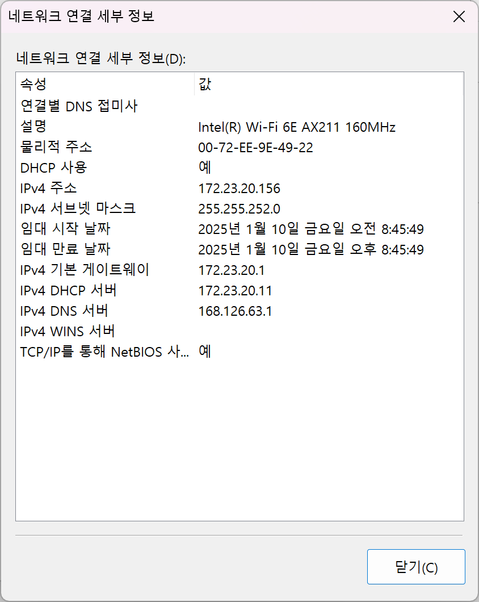

# [CS] 250110 실습 29번

### 네트워크 구성 요소 탐색 실습

윈도우에서 네트워크 및 공유센터 열기에 가서 본인이 사용하고 있는 네트워크를 클릭하고 다음 정보를 확인하시오.

|항목|결과|
|---|---|
|IPv4 주소|172.23.20.156|
|IPv4 서브넷 마스크|255.255.252.0|
|IPv6 주소||
|MAC 주소|00-72-EE--9E-49-22|