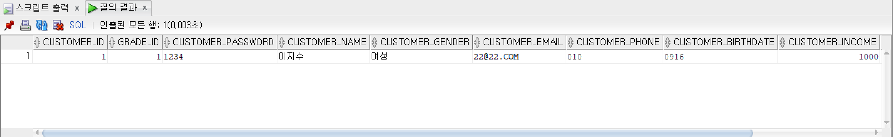
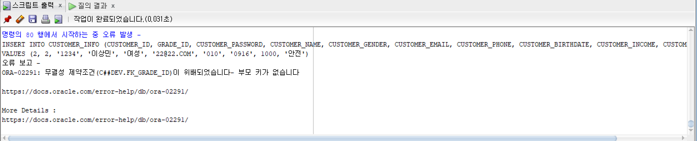

# [SQL] 250114 실습 2번

### 물리 모델 $\rightarrow$ 테이블 생성 

테이블 생성은 다음과 같다.
```sql
CREATE TABLE CUSTOMER_GRADES (
    GRADE_ID NUMBER PRIMARY KEY,
    GRADE_NAME VARCHAR2(64)
);
--DROP TABLE CUSTOMER_GRADES;

CREATE TABLE CUSTOMER_INFO (
    CUSTOMER_ID NUMBER PRIMARY KEY,
    GRADE_ID NUMBER,
    CUSTOMER_PASSWORD VARCHAR2(64),
    CUSTOMER_NAME VARCHAR2(64),
    CUSTOMER_GENDER VARCHAR2(64),
    CUSTOMER_EMAIL VARCHAR2(64),
    CUSTOMER_PHONE VARCHAR2(64),
    CUSTOMER_BIRTHDATE VARCHAR2(64),
    CUSTOMER_INCOME NUMBER,
    CUSTOMER_RISK_TOLERANCE VARCHAR2(64),
    CONSTRAINT FK_GRADE_ID FOREIGN KEY (GRADE_ID) REFERENCES CUSTOMER_GRADES (GRADE_ID)
);
--DROP TABLE CUSTOMER_INFO;

CREATE TABLE ACCOUNT_INFO (
    ACCOUNT_NUMBER VARCHAR2(64) PRIMARY KEY,
    CUSTOMER_ID NUMBER,
    ACCOUNT_STATUS VARCHAR2(64),
    ACCOUNT_TYPE VARCHAR2(64),
    ACCOUNT_NAME VARCHAR2(64),
    ACCOUNT_PASSWORD VARCHAR2(64),
    OPEN_DATE VARCHAR2(64),
    CLOSE_DATE VARCHAR2(64),
    DEPOSIT NUMBER,
    WITHHOLDING NUMBER,
    CONSTRAINT FK_CUSTOMER_ID FOREIGN KEY (CUSTOMER_ID) REFERENCES CUSTOMER_INFO (CUSTOMER_ID)
);
--DROP TABLE ACCOUNT_INFO;

CREATE TABLE SECURITIES_ORDERS (
    OFFER_ID NUMBER PRIMARY KEY,
    ACCOUNT_NUMBER VARCHAR2(64),
    OFFER_DATE VARCHAR2(64),
    PRODUCT_ID VARCHAR2(64),
    OFFER_STATUS VARCHAR2(64),
    OFFER_TYPE VARCHAR2(64),
    QUANTITY NUMBER,
    PRICE NUMBER,
    TRADED NUMBER,
    NOT_TRADED NUMBER,
    CONSTRAINT FK_ACCOUNT_NUMBER FOREIGN KEY (ACCOUNT_NUMBER) REFERENCES ACCOUNT_INFO (ACCOUNT_NUMBER)
);
--DROP TABLE SECURITIES_ORDERS;

CREATE TABLE STOCK_INFO (
    STOCK_ID NUMBER PRIMARY KEY,
    PREVIOUS_CLOSE NUMBER,
    OPEN_PRICE NUMBER,
    HIGH_PRICE NUMBER,
    LOW_PRICE NUMBER,
    VOLUME NUMBER,
    STOCK_DATE VARCHAR2(64),
    DIVIDEND NUMBER,
    DIVIDEND_DATE VARCHAR2(64)
);
--DROP TABLE STOCK_INFO;

CREATE TABLE STOCK_DIVIDENDS (
    DIVIDEND_ID NUMBER PRIMARY KEY,
    ACCOUNT_NUMBER VARCHAR2(64),
    STOCK_ID NUMBER,
    CONSTRAINT FK_ACCOUNT_NUMBER_DIVIDENDS FOREIGN KEY (ACCOUNT_NUMBER) REFERENCES ACCOUNT_INFO (ACCOUNT_NUMBER),
    CONSTRAINT FK_STOCK_ID FOREIGN KEY (STOCK_ID) REFERENCES STOCK_INFO (STOCK_ID)
);
--DROP TABLE STOCK_DIVIDENDS;
```

모든 테이블에 데이터를 삽입한 결과를 첨부하기에는 너무 양이 많기 때문에, 일부 테이블만 데이터를 삽입한다.
```sql
INSERT INTO CUSTOMER_GRADES (GRADE_ID, GRADE_NAME)
VALUES (1, '임광영');

INSERT INTO CUSTOMER_INFO (CUSTOMER_ID, GRADE_ID, CUSTOMER_PASSWORD, CUSTOMER_NAME, CUSTOMER_GENDER, CUSTOMER_EMAIL, CUSTOMER_PHONE, CUSTOMER_BIRTHDATE, CUSTOMER_INCOME, CUSTOMER_RISK_TOLERANCE)
VALUES (1, 1, '1234', '이지수', '여성', '22@22.COM', '010', '0916', 1000, '안전');
```

삽입한 데이터를 조회하면 다음과 같다.
```sql
SELECT * FROM CUSTOMER_INFO;
```


해당 코드를 실행하면 `CUSTOMER_ID`가 `2`에 해당하는 부모키가 존재하지 않기 때문에, 무결정 제약 조건이 위배됨을 알 수 있다.
```sql
INSERT INTO CUSTOMER_INFO (CUSTOMER_ID, GRADE_ID, CUSTOMER_PASSWORD, CUSTOMER_NAME, CUSTOMER_GENDER, CUSTOMER_EMAIL, CUSTOMER_PHONE, CUSTOMER_BIRTHDATE, CUSTOMER_INCOME, CUSTOMER_RISK_TOLERANCE)
VALUES (2, 2, '1234', '이상민', '여성', '22@22.COM', '010', '0916', 1000, '안전');
```
